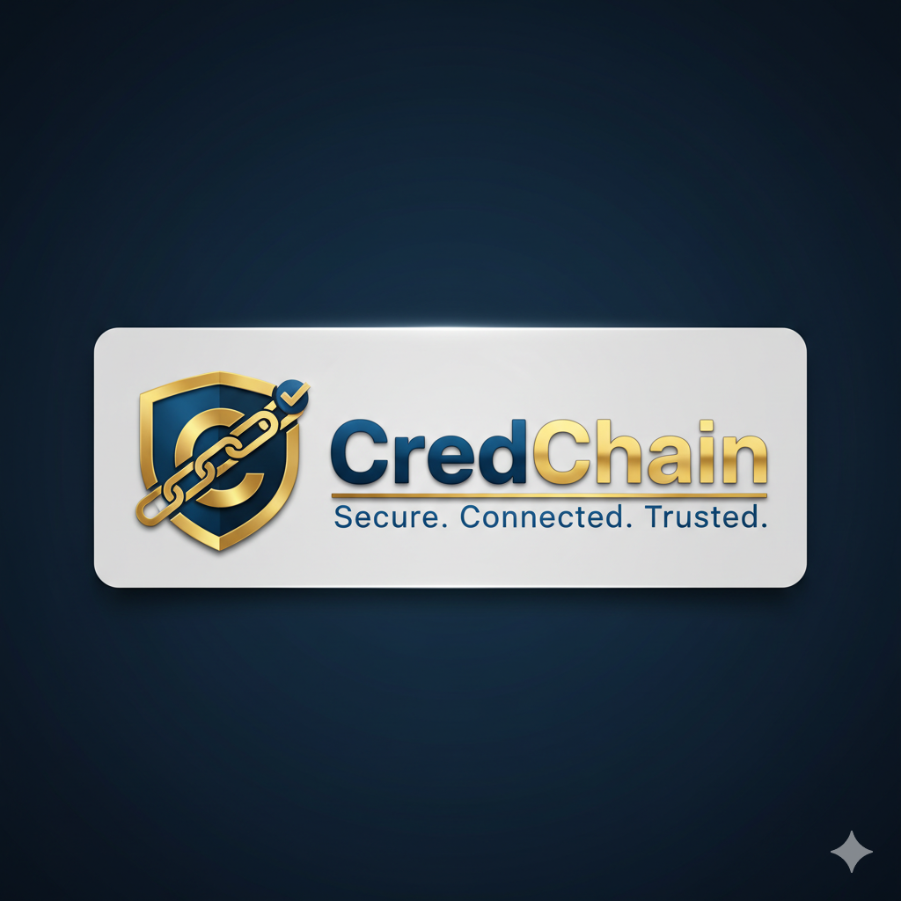

# 📚 CredChain - Documentação Completa do Sistema

  
   
  <strong>Secure. Connected. Trusted.</strong>

> **Sistema inovador de credit scoring baseado em blockchain e IA, democratizando o acesso ao crédito na América Latina**

## 🌍 Idiomas / Languages / Idiomas

- [🇧🇷 Português](#-português)
- [🇺🇸 English](#-english)
- [🇪🇸 Español](#-español)

---

## 🇧🇷 Português

### 🎯 O que é o CredChain?

O **CredChain** é um sistema descentralizado de credit scoring que utiliza **blockchain** e **inteligência artificial** para democratizar o acesso ao crédito na América Latina. O sistema combina tecnologias avançadas como **ElizaOS** (agentes de IA especializados) e **Polkadot/Substrate** para criar um ecossistema transparente, justo e verificável de avaliação de crédito.

### 🚀 Principais Funcionalidades

#### **1. Sistema de Credit Scoring Inteligente**
- **Análise Multifatorial**: Avalia 8 fatores principais que influenciam o score de crédito
- **Machine Learning**: Utiliza modelos de IA para previsões precisas
- **Transparência Total**: Todos os cálculos são auditáveis e verificáveis
- **Score Range**: 300-850 pontos (padrão internacional)

#### **2. Agentes de IA Especializados (ElizaOS)**
- **🤖 Orchestrator Agent**: Coordena todos os sub-agentes especializados
- **📊 Credit Analyzer Agent**: Análise de histórico de pagamentos e cálculo de score
- **🛡️ Compliance Guardian Agent**: Verificação LGPD, GDPR e Basel III
- **🔍 Fraud Detector Agent**: Detecção de padrões suspeitos e fraudes
- **👤 User Assistant Agent**: Suporte ao usuário 24/7 com educação financeira
- **💡 Financial Advisor Agent**: Recomendações personalizadas e planejamento financeiro

#### **3. Blockchain Descentralizado**
- **Polkadot Parachain**: Registro imutável de scores e transações
- **Smart Contracts**: Lógica de negócio imutável e verificável
- **Cross-Chain**: Comunicação entre diferentes blockchains
- **Oracle Integration**: Dados externos em tempo real

#### **4. APIs Modernas e Integradas**
- **REST API**: Endpoints para integração com sistemas externos
- **GraphQL**: Consultas flexíveis e eficientes
- **WebSocket**: Comunicação em tempo real
- **gRPC**: Comunicação de alta performance entre microserviços

#### **5. Interfaces Multi-Plataforma**
- **Web Dashboard**: Interface completa para instituições financeiras
- **Mobile App**: Aplicativo para usuários finais (React Native)
- **Chat Integrado**: Conversação com agentes de IA
- **Analytics Dashboard**: Métricas e relatórios em tempo real

### 🔧 Como Funciona o Sistema

#### **Fluxo de Análise de Crédito:**

1. **Coleta de Dados**
   - Histórico de pagamentos
   - Dados bancários (Open Banking)
   - Informações de identidade (KYC)
   - Dados comportamentais

2. **Processamento por IA**
   - Análise por múltiplos agentes especializados
   - Cálculo de score baseado em machine learning
   - Detecção de fraudes e anomalias
   - Verificação de compliance

3. **Registro na Blockchain**
   - Score registrado de forma imutável
   - Transparência total do processo
   - Verificação por múltiplas partes
   - Histórico auditável

4. **Entrega de Resultados**
   - Score final calculado
   - Explicação detalhada dos fatores
   - Recomendações personalizadas
   - Relatórios de compliance

### 🏗️ Arquitetura Técnica

#### **Frontend Layer**
- **Next.js 14**: Framework React com SSR
- **TypeScript**: Tipagem estática
- **Tailwind CSS**: Styling moderno
- **Recharts**: Visualizações de dados

#### **Backend Layer**
- **Node.js 22.x**: Runtime JavaScript
- **Express.js**: Framework web
- **Microserviços**: Arquitetura distribuída
- **GraphQL + REST**: APIs híbridas

#### **Blockchain Layer**
- **Polkadot/Substrate**: Blockchain principal
- **Rust**: Linguagem para pallets
- **ink!**: Smart contracts
- **XCM**: Cross-chain messaging

#### **IA Layer**
- **ElizaOS**: Framework de agentes
- **TensorFlow.js**: Machine learning
- **Anthropic Claude**: Modelo de linguagem
- **Voice Integration**: TTS/STT

### 🔐 Segurança e Compliance

#### **Segurança Implementada**
- **Criptografia AES-256**: Dados sensíveis protegidos
- **Rate Limiting**: Proteção contra ataques
- **Audit Logging**: Registro completo de ações
- **Headers de Segurança**: Proteção contra XSS/CSRF

#### **Compliance Regulatória**
- **LGPD**: Lei Geral de Proteção de Dados (Brasil)
- **GDPR**: Regulamento Geral de Proteção de Dados (Europa)
- **Basel III**: Acordos de Basileia para bancos
- **KYC/AML**: Conheça seu cliente e anti-lavagem

### 📊 Benefícios do Sistema

#### **Para Usuários Finais**
- ✅ **Acesso Democrático**: Crédito para todos os perfis
- ✅ **Transparência**: Entendimento completo do score
- ✅ **Educação Financeira**: Agentes de IA educam sobre finanças
- ✅ **Privacidade**: Controle total sobre dados pessoais

#### **Para Instituições Financeiras**
- ✅ **Redução de Risco**: Análise mais precisa de crédito
- ✅ **Automação**: Processos automatizados por IA
- ✅ **Compliance**: Conformidade regulatória automática
- ✅ **Eficiência**: Redução de custos operacionais

#### **Para o Mercado**
- ✅ **Inclusão Financeira**: Mais pessoas com acesso ao crédito
- ✅ **Transparência**: Sistema auditável e verificável
- ✅ **Inovação**: Tecnologia de ponta aplicada
- ✅ **Competitividade**: Mercado mais eficiente

### 🚀 Casos de Uso

#### **1. Análise de Crédito Pessoal**
- Avaliação de score para empréstimos pessoais
- Análise de capacidade de pagamento
- Recomendações de produtos financeiros

#### **2. Microcrédito e P2P Lending**
- Avaliação de risco para pequenos empréstimos
- Conecta investidores com tomadores
- Redução de custos de intermediação

#### **3. Fintech e Bancos Digitais**
- Integração com sistemas bancários
- APIs para produtos financeiros
- Automação de processos de crédito

#### **4. Seguros e Proteção**
- Avaliação de risco para seguros
- Análise de comportamento
- Precificação dinâmica

### 📈 Impacto Social

#### **Democratização do Crédito**
- **Inclusão Financeira**: Acesso ao crédito para populações subatendidas
- **Transparência**: Sistema justo e auditável
- **Educação**: Agentes de IA educam sobre finanças
- **Empoderamento**: Usuários controlam seus dados

#### **Inovação Tecnológica**
- **Blockchain**: Tecnologia descentralizada aplicada
- **IA**: Inteligência artificial para análise de crédito
- **Open Banking**: Integração com dados bancários
- **Cross-Chain**: Interoperabilidade entre blockchains

---

## 🇺🇸 English

### 🎯 What is CredChain?

**CredChain** is a decentralized credit scoring system that uses **blockchain** and **artificial intelligence** to democratize access to credit in Latin America. The system combines advanced technologies like **ElizaOS** (specialized AI agents) and **Polkadot/Substrate** to create a transparent, fair, and verifiable credit evaluation ecosystem.

### 🚀 Key Features

#### **1. Intelligent Credit Scoring System**
- **Multi-Factor Analysis**: Evaluates 8 main factors that influence credit score
- **Machine Learning**: Uses AI models for accurate predictions
- **Total Transparency**: All calculations are auditable and verifiable
- **Score Range**: 300-850 points (international standard)

#### **2. Specialized AI Agents (ElizaOS)**
- **🤖 Orchestrator Agent**: Coordinates all specialized sub-agents
- **📊 Credit Analyzer Agent**: Payment history analysis and score calculation
- **🛡️ Compliance Guardian Agent**: LGPD, GDPR, and Basel III verification
- **🔍 Fraud Detector Agent**: Suspicious pattern and fraud detection
- **👤 User Assistant Agent**: 24/7 user support with financial education
- **💡 Financial Advisor Agent**: Personalized recommendations and financial planning

#### **3. Decentralized Blockchain**
- **Polkadot Parachain**: Immutable record of scores and transactions
- **Smart Contracts**: Immutable and verifiable business logic
- **Cross-Chain**: Communication between different blockchains
- **Oracle Integration**: Real-time external data

#### **4. Modern and Integrated APIs**
- **REST API**: Endpoints for external system integration
- **GraphQL**: Flexible and efficient queries
- **WebSocket**: Real-time communication
- **gRPC**: High-performance communication between microservices

#### **5. Multi-Platform Interfaces**
- **Web Dashboard**: Complete interface for financial institutions
- **Mobile App**: Application for end users (React Native)
- **Integrated Chat**: Conversation with AI agents
- **Analytics Dashboard**: Real-time metrics and reports

### 🔧 How the System Works

#### **Credit Analysis Flow:**

1. **Data Collection**
   - Payment history
   - Banking data (Open Banking)
   - Identity information (KYC)
   - Behavioral data

2. **AI Processing**
   - Analysis by multiple specialized agents
   - Score calculation based on machine learning
   - Fraud and anomaly detection
   - Compliance verification

3. **Blockchain Registration**
   - Score registered immutably
   - Total process transparency
   - Verification by multiple parties
   - Auditable history

4. **Results Delivery**
   - Final calculated score
   - Detailed explanation of factors
   - Personalized recommendations
   - Compliance reports

### 🏗️ Technical Architecture

#### **Frontend Layer**
- **Next.js 14**: React framework with SSR
- **TypeScript**: Static typing
- **Tailwind CSS**: Modern styling
- **Recharts**: Data visualizations

#### **Backend Layer**
- **Node.js 22.x**: JavaScript runtime
- **Express.js**: Web framework
- **Microservices**: Distributed architecture
- **GraphQL + REST**: Hybrid APIs

#### **Blockchain Layer**
- **Polkadot/Substrate**: Main blockchain
- **Rust**: Language for pallets
- **ink!**: Smart contracts
- **XCM**: Cross-chain messaging

#### **AI Layer**
- **ElizaOS**: Agent framework
- **TensorFlow.js**: Machine learning
- **Anthropic Claude**: Language model
- **Voice Integration**: TTS/STT

### 🔐 Security and Compliance

#### **Implemented Security**
- **AES-256 Encryption**: Sensitive data protection
- **Rate Limiting**: Attack protection
- **Audit Logging**: Complete action logging
- **Security Headers**: XSS/CSRF protection

#### **Regulatory Compliance**
- **LGPD**: General Data Protection Law (Brazil)
- **GDPR**: General Data Protection Regulation (Europe)
- **Basel III**: Basel agreements for banks
- **KYC/AML**: Know your customer and anti-money laundering

### 📊 System Benefits

#### **For End Users**
- ✅ **Democratic Access**: Credit for all profiles
- ✅ **Transparency**: Complete understanding of score
- ✅ **Financial Education**: AI agents educate about finances
- ✅ **Privacy**: Total control over personal data

#### **For Financial Institutions**
- ✅ **Risk Reduction**: More accurate credit analysis
- ✅ **Automation**: AI-automated processes
- ✅ **Compliance**: Automatic regulatory compliance
- ✅ **Efficiency**: Operational cost reduction

#### **For the Market**
- ✅ **Financial Inclusion**: More people with credit access
- ✅ **Transparency**: Auditable and verifiable system
- ✅ **Innovation**: Cutting-edge technology applied
- ✅ **Competitiveness**: More efficient market

### 🚀 Use Cases

#### **1. Personal Credit Analysis**
- Score evaluation for personal loans
- Payment capacity analysis
- Financial product recommendations

#### **2. Microcredit and P2P Lending**
- Risk assessment for small loans
- Connects investors with borrowers
- Intermediation cost reduction

#### **3. Fintech and Digital Banks**
- Integration with banking systems
- APIs for financial products
- Credit process automation

#### **4. Insurance and Protection**
- Risk assessment for insurance
- Behavior analysis
- Dynamic pricing

### 📈 Social Impact

#### **Credit Democratization**
- **Financial Inclusion**: Credit access for underserved populations
- **Transparency**: Fair and auditable system
- **Education**: AI agents educate about finances
- **Empowerment**: Users control their data

#### **Technological Innovation**
- **Blockchain**: Decentralized technology applied
- **AI**: Artificial intelligence for credit analysis
- **Open Banking**: Integration with banking data
- **Cross-Chain**: Interoperability between blockchains

---

## 🇪🇸 Español

### 🎯 ¿Qué es CredChain?

**CredChain** es un sistema descentralizado de scoring crediticio que utiliza **blockchain** e **inteligencia artificial** para democratizar el acceso al crédito en América Latina. El sistema combina tecnologías avanzadas como **ElizaOS** (agentes de IA especializados) y **Polkadot/Substrate** para crear un ecosistema transparente, justo y verificable de evaluación crediticia.

### 🚀 Características Principales

#### **1. Sistema Inteligente de Scoring Crediticio**
- **Análisis Multifactorial**: Evalúa 8 factores principales que influyen en el score crediticio
- **Machine Learning**: Utiliza modelos de IA para predicciones precisas
- **Transparencia Total**: Todos los cálculos son auditables y verificables
- **Rango de Score**: 300-850 puntos (estándar internacional)

#### **2. Agentes de IA Especializados (ElizaOS)**
- **🤖 Orchestrator Agent**: Coordina todos los sub-agentes especializados
- **📊 Credit Analyzer Agent**: Análisis de historial de pagos y cálculo de score
- **🛡️ Compliance Guardian Agent**: Verificación LGPD, GDPR y Basel III
- **🔍 Fraud Detector Agent**: Detección de patrones sospechosos y fraudes
- **👤 User Assistant Agent**: Soporte al usuario 24/7 con educación financiera
- **💡 Financial Advisor Agent**: Recomendaciones personalizadas y planificación financiera

#### **3. Blockchain Descentralizado**
- **Polkadot Parachain**: Registro inmutable de scores y transacciones
- **Smart Contracts**: Lógica de negocio inmutable y verificable
- **Cross-Chain**: Comunicación entre diferentes blockchains
- **Oracle Integration**: Datos externos en tiempo real

#### **4. APIs Modernas e Integradas**
- **REST API**: Endpoints para integración con sistemas externos
- **GraphQL**: Consultas flexibles y eficientes
- **WebSocket**: Comunicación en tiempo real
- **gRPC**: Comunicación de alta performance entre microservicios

#### **5. Interfaces Multi-Plataforma**
- **Web Dashboard**: Interfaz completa para instituciones financieras
- **Mobile App**: Aplicación para usuarios finales (React Native)
- **Chat Integrado**: Conversación con agentes de IA
- **Analytics Dashboard**: Métricas y reportes en tiempo real

### 🔧 Cómo Funciona el Sistema

#### **Flujo de Análisis Crediticio:**

1. **Recolección de Datos**
   - Historial de pagos
   - Datos bancarios (Open Banking)
   - Información de identidad (KYC)
   - Datos comportamentales

2. **Procesamiento por IA**
   - Análisis por múltiples agentes especializados
   - Cálculo de score basado en machine learning
   - Detección de fraudes y anomalías
   - Verificación de compliance

3. **Registro en Blockchain**
   - Score registrado de forma inmutable
   - Transparencia total del proceso
   - Verificación por múltiples partes
   - Historial auditable

4. **Entrega de Resultados**
   - Score final calculado
   - Explicación detallada de los factores
   - Recomendaciones personalizadas
   - Reportes de compliance

### 🏗️ Arquitectura Técnica

#### **Frontend Layer**
- **Next.js 14**: Framework React con SSR
- **TypeScript**: Tipado estático
- **Tailwind CSS**: Styling moderno
- **Recharts**: Visualizaciones de datos

#### **Backend Layer**
- **Node.js 22.x**: Runtime JavaScript
- **Express.js**: Framework web
- **Microservicios**: Arquitectura distribuida
- **GraphQL + REST**: APIs híbridas

#### **Blockchain Layer**
- **Polkadot/Substrate**: Blockchain principal
- **Rust**: Lenguaje para pallets
- **ink!**: Smart contracts
- **XCM**: Cross-chain messaging

#### **IA Layer**
- **ElizaOS**: Framework de agentes
- **TensorFlow.js**: Machine learning
- **Anthropic Claude**: Modelo de lenguaje
- **Voice Integration**: TTS/STT

### 🔐 Seguridad y Compliance

#### **Seguridad Implementada**
- **Cifrado AES-256**: Protección de datos sensibles
- **Rate Limiting**: Protección contra ataques
- **Audit Logging**: Registro completo de acciones
- **Headers de Seguridad**: Protección contra XSS/CSRF

#### **Compliance Regulatorio**
- **LGPD**: Ley General de Protección de Datos (Brasil)
- **GDPR**: Reglamento General de Protección de Datos (Europa)
- **Basel III**: Acuerdos de Basilea para bancos
- **KYC/AML**: Conoce a tu cliente y anti-lavado

### 📊 Beneficios del Sistema

#### **Para Usuarios Finales**
- ✅ **Acceso Democrático**: Crédito para todos los perfiles
- ✅ **Transparencia**: Comprensión completa del score
- ✅ **Educación Financiera**: Agentes de IA educan sobre finanzas
- ✅ **Privacidad**: Control total sobre datos personales

#### **Para Instituciones Financieras**
- ✅ **Reducción de Riesgo**: Análisis más preciso de crédito
- ✅ **Automatización**: Procesos automatizados por IA
- ✅ **Compliance**: Cumplimiento regulatorio automático
- ✅ **Eficiencia**: Reducción de costos operacionales

#### **Para el Mercado**
- ✅ **Inclusión Financiera**: Más personas con acceso al crédito
- ✅ **Transparencia**: Sistema auditable y verificable
- ✅ **Innovación**: Tecnología de punta aplicada
- ✅ **Competitividad**: Mercado más eficiente

### 🚀 Casos de Uso

#### **1. Análisis de Crédito Personal**
- Evaluación de score para préstamos personales
- Análisis de capacidad de pago
- Recomendaciones de productos financieros

#### **2. Microcrédito y P2P Lending**
- Evaluación de riesgo para pequeños préstamos
- Conecta inversores con prestatarios
- Reducción de costos de intermediación

#### **3. Fintech y Bancos Digitales**
- Integración con sistemas bancarios
- APIs para productos financieros
- Automatización de procesos de crédito

#### **4. Seguros y Protección**
- Evaluación de riesgo para seguros
- Análisis de comportamiento
- Precios dinámicos

### 📈 Impacto Social

#### **Democratización del Crédito**
- **Inclusión Financiera**: Acceso al crédito para poblaciones subatendidas
- **Transparencia**: Sistema justo y auditable
- **Educación**: Agentes de IA educan sobre finanzas
- **Empoderamiento**: Usuarios controlan sus datos

#### **Innovación Tecnológica**
- **Blockchain**: Tecnología descentralizada aplicada
- **IA**: Inteligencia artificial para análisis crediticio
- **Open Banking**: Integración con datos bancarios
- **Cross-Chain**: Interoperabilidad entre blockchains

---

## 🎯 Resumo Executivo / Executive Summary / Resumen Ejecutivo

### 🇧🇷 **CredChain: Revolucionando o Credit Scoring na América Latina**

O CredChain é um sistema inovador que combina **blockchain**, **inteligência artificial** e **tecnologias descentralizadas** para democratizar o acesso ao crédito. Com **6 agentes de IA especializados**, **blockchain Polkadot** e **APIs modernas**, o sistema oferece transparência total, segurança avançada e inclusão financeira para todos os perfis de usuários.

### 🇺🇸 **CredChain: Revolutionizing Credit Scoring in Latin America**

CredChain is an innovative system that combines **blockchain**, **artificial intelligence**, and **decentralized technologies** to democratize credit access. With **6 specialized AI agents**, **Polkadot blockchain**, and **modern APIs**, the system offers total transparency, advanced security, and financial inclusion for all user profiles.

### 🇪🇸 **CredChain: Revolucionando el Scoring Crediticio en América Latina**

CredChain es un sistema innovador que combina **blockchain**, **inteligencia artificial** y **tecnologías descentralizadas** para democratizar el acceso al crédito. Con **6 agentes de IA especializados**, **blockchain Polkadot** y **APIs modernas**, el sistema ofrece transparencia total, seguridad avanzada e inclusión financiera para todos los perfiles de usuarios.

---

## 📞 Contato / Contact / Contacto

- **Website**: https://credchain-mainnet.vercel.app
- **Email**: support@credchain.io
- **GitHub**: https://github.com/credchain/credchain
- **Documentation**: [TECHNICAL_DOCS.md](TECHNICAL_DOCS.md)

---

**🎉 CredChain está pronto para democratizar o acesso ao crédito na América Latina!** 🚀🇧🇷
